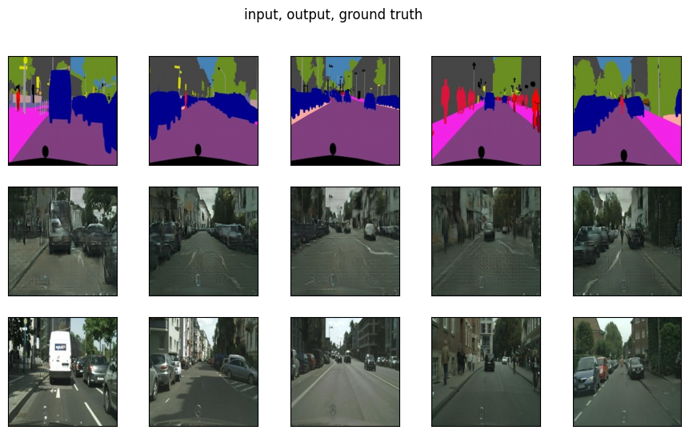
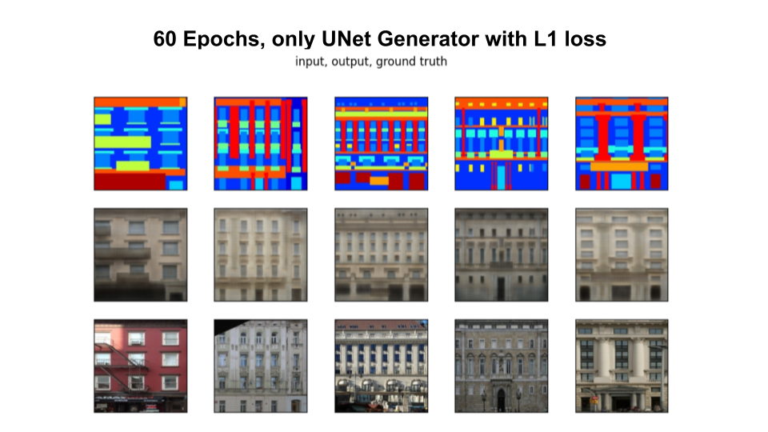

## cGAN experiments
#### Implementation of: 
- Pix2pix paper: https://arxiv.org/abs/1611.07004
- cGAN (For MNIST)
- GAN (For MNIST)

### Pix2Pix CGAN (Unet + PatchGAN: GAN Loss + L1)
#### Facades 100 epoches (400 images)

#### Maps 40 epoches (1.3k images)

#### CityScapes 20 epoches (3k images)

#### Parameters:
D_architecture: `PatchGAN 70x70`
D_lr = G_lr: `0.0002`
D_betas = G_betas: `(0.5, 0.999)`
Optimizers: `Adam + Adam`
EPOCHS: `100`
G_architecture: `Unet`
init_mean: `0`
init_std: `0.02`
lambda: `100`
Batch size: `1`
Augmentations: Resize to `(286, 286)` then RandomCrop, then Random Flip

PatchGAN 70x70 is applied to the image of size of `(256x256)` it downsample to `(30x30)`, each pixel of the new picture represents predicted probability of overlaping patch of size `(70x70)` to be from real distribution.

### CGAN (MLP + MLP) on MNIST

As you can observe from the picture, two MLP is enough to get ahold of such primitive dataset.

Parameters:
1. `50` Epoches 
2. Discriminator and Generator are both of `MLP` architecture
3. Optimizers: Adam + Adam, `lr = 3e-4`, `betas=(0.9, 0.999)`

Embeddings:
Learnable `torch.nn.Embedding`

### Pix2Pix CGAN (Unet: only L1 Loss)

### References:
1. https://arxiv.org/abs/1611.07004
2. https://arxiv.org/abs/1411.1784
3. https://machinelearningmastery.com/how-to-develop-a-conditional-generative-adversarial-network-from-scratch/
4. https://d2l.ai/chapter_generative-adversarial-networks/index.html
5. https://www.youtube.com/watch?v=banZhpreS2Y&list=PLEwK9wdS5g0onnKgvKxuUJN1Ojchl9Q9P&index=22
6. https://github.com/soumith/ganhacks
7. https://developers.google.com/machine-learning/gan/problems
8. https://www.kaggle.com/code/kmldas/mnist-generative-adverserial-networks-in-pytorch
9. http://efrosgans.eecs.berkeley.edu/pix2pix/datasets/
